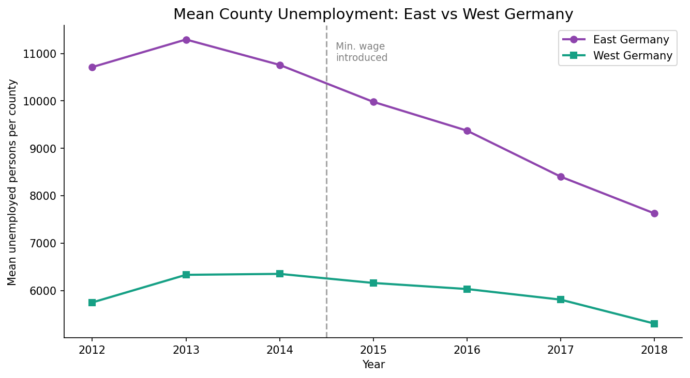
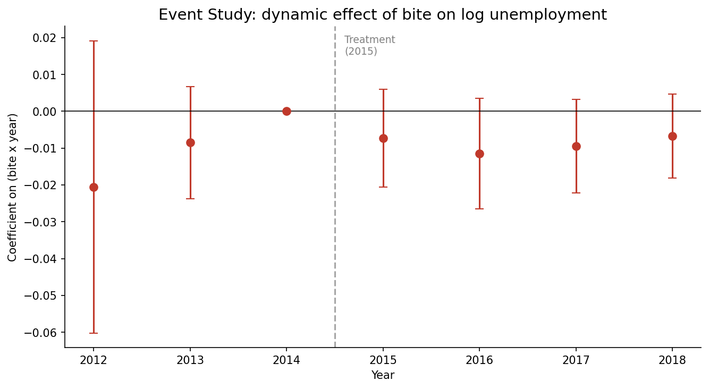

# Did Germany's 2015 Minimum Wage Cost Jobs?

A difference-in-differences study of Germany's first national minimum wage (8.50 EUR/hour, introduced 1 January 2015), using **real county-level data** from the German Federal Employment Agency.

## Research Question

Critics warned that the minimum wage would cause job losses in low-wage regions. This project tests that empirically using a regional difference-in-differences design.

## Data

Real data from the German Federal Employment Agency (Bundesagentur fuer Arbeit), packaged by the open-source RegioHub `badata` project (Nguyen & Tsolak 2023, MIT licence, DOI 10.5281/zenodo.7664361):

- 400 German counties (Kreise)
- 2012 to 2018
- Outcome: registered unemployed persons per county-year

`data/raw/build_panel.py` reproducibly rebuilds the panel from the original Zenodo source.

## Identification

The minimum wage was nationally uniform but bit harder where more workers earned low wages. Following the literature (Caliendo et al. 2018; Ahlfeldt, Roth & Seidel 2018), the design uses a **regional bite** measure.

Because worker-level wage data is access-restricted, the bite is **proxied** by pre-treatment (2014) unemployment intensity, which correlates strongly with the low-wage share and with East Germany, where the floor bit hardest.

## Methods

| Specification | Description |
|---|---|
| Canonical 2x2 DiD | OLS with treated x post, clustered SEs |
| Two-way fixed effects | County + year FE, continuous bite x post |
| Event study | Year-by-year coefficients, parallel-trends check |

Built with Python: `linearmodels` (PanelOLS), `statsmodels`.

## Key Finding

The effect of minimum-wage bite on unemployment is **small and statistically insignificant**. There is no evidence the policy raised unemployment in high-bite regions, consistent with the published German literature finding negligible employment effects.

The descriptive picture is striking: high-bite Eastern counties saw unemployment fall *faster* after 2015, not rise.





## Honest Caveats

This project uses real, open data but has real limitations, stated plainly:

1. **Bite is proxied, not measured.** The gold-standard bite (share earning below 8.50 EUR) requires restricted worker-level data. The unemployment-based proxy is a reasonable but imperfect substitute.
2. **Pre-trends are approximately, not perfectly, parallel.** The result should be read as suggestive, not definitive.
3. **Outcome is unemployment, not employment.** The open dataset's employment series only starts in 2016, so unemployment (available from 2012) is used as the labour-market outcome.

These define the honest boundary of what this open dataset supports.

## Project Structure

```
minimum-wage-did/
├── data/
│   ├── raw/
│   │   ├── ba_unemployment_panel.csv   # the real panel
│   │   └── build_panel.py              # rebuilds it from Zenodo
│   └── processed/
├── notebooks/
│   └── minimum_wage_did.ipynb
├── src/
│   ├── data_loader.py
│   ├── did.py
│   └── visualize.py
├── reports/
└── requirements.txt
```

## References

- Ahlfeldt, Roth & Seidel (2018), "The regional effects of Germany's national minimum wage", Economics Letters
- Caliendo et al. (2018), studies on the German minimum wage introduction
- Nguyen & Tsolak (2023), badata, DOI 10.5281/zenodo.7664361
- Card & Krueger (1994), the foundational minimum-wage DiD design

## Author

Nia Kharaishvili | github.com/niakharaishvili
